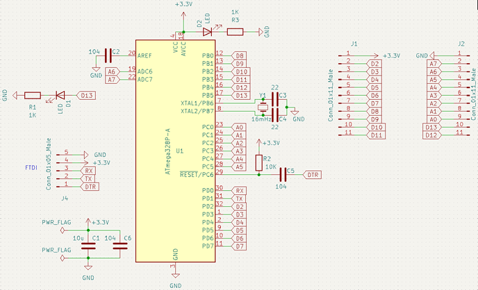
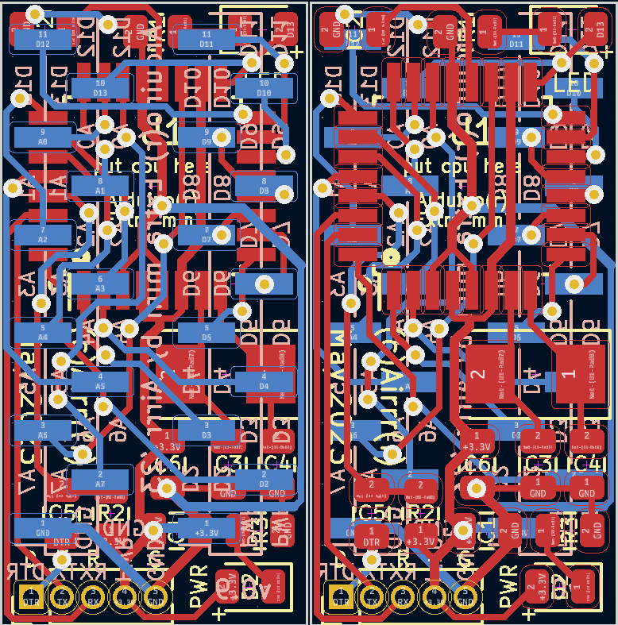
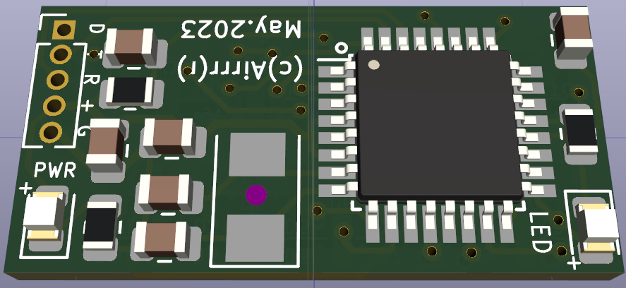
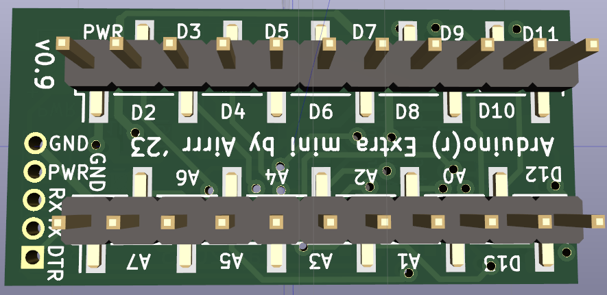
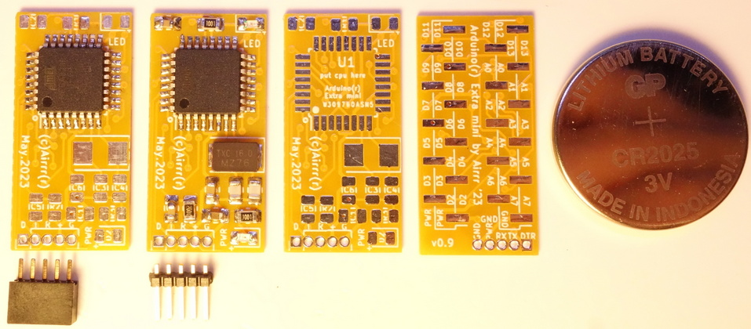

# ATmega328p tqfp extra mini board. 
  
AArduino.  
  
  
**Board version 0.9: ** 
I just wanted to make a smaller board for this microcontroller.  
Size is 12.5mm X 21.5mm only!   
So here is minimal ATmega328p configuration. All pins are exposed for use.  
No voltage regulator, 5.0v maximum. rtfm.  
You can flash a bootloader after soldering the cpu, use SPI pins then.  
  
  
  
  Parts:  
- ATmega328p-au, TQFP.  
- 16mHz quartz, 5.0x3.2mm.  
- Some Rs, Cs and LEDs, 0805.  
- Programming pin header, 5 pins, P1.27.  
- Optional "left-first pin header" (or right) 2.00mm pitch.  
  
  
Soft:
No firmware, use arduino bootloader.  
  
  
Photos:  

Can be soldered with first-left (right) pinheader 2.0mm:

The same:

